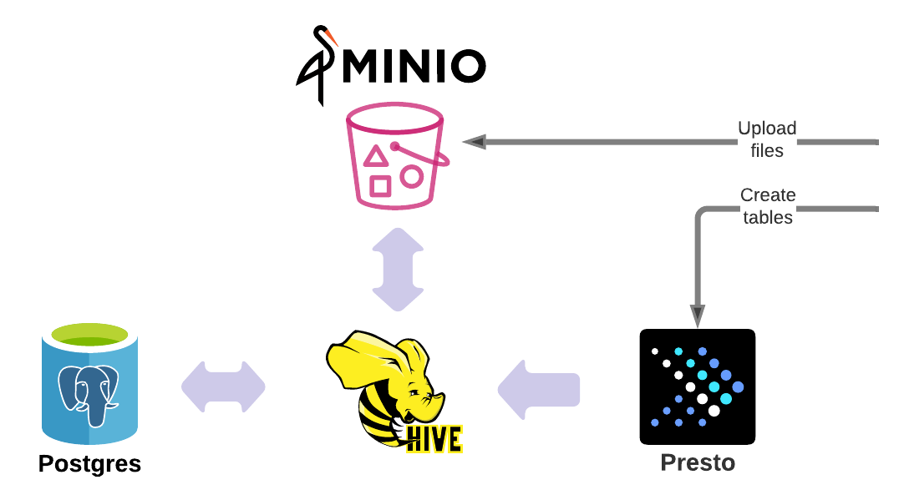

# Presto cluster example
This is a cluster mode example of Presto that implements the Vault provider to store credentials for Presto, Minio and Postgres.
The example use of the module spins up Presto in [cluster mode](../../conf/nomad/presto.hcl) having one worker and one coordinator.

Before deploying the module, Vault K/V store should contain all required credentials and policies.
In this example, all required actions are automated by Ansible. See the following files for details.

- Required policy [01-create-vault-policy-to-read-secrets.yml](../../dev/vagrant/bootstrap/vault/post/01-create-vault-policy-to-read-secrets.yml)
- Required credentials [00_generate_secrets_vault.yml](../../dev/ansible/00_generate_secrets_vault.yml)

Vault provides credentials for Minio and Postgres, and render them directly into the Nomad job.

## Modules in use
| Modules       | version       |
| ------------- |:-------------:|
| [terraform-nomad-postgres](https://github.com/fredrikhgrelland/terraform-nomad-postgres) | 0.3.0 |
| [terraform-nomad-minio](https://github.com/fredrikhgrelland/terraform-nomad-minio) | 0.3.0 |
| [terraform-nomad-hive](https://github.com/fredrikhgrelland/terraform-nomad-hive) | 0.3.0 |

## Services


## Example of uploaded files
This example uses the following file types found in the [example/resources/data](../resources/data) folder:
- csv
- json
- avro
- protobuf

Directory [`/resources`](../resources) contains data example with will be loaded to technology stack in the current example.

```text
├── resources
│   ├── data/           # files that are uploaded to minio
│   ├── images/         # images for documentation
│   ├── query/          # presto query example for uploaded data
│   └── schema/         # schema(s) for data serializers/deserializers
├── ...
```
